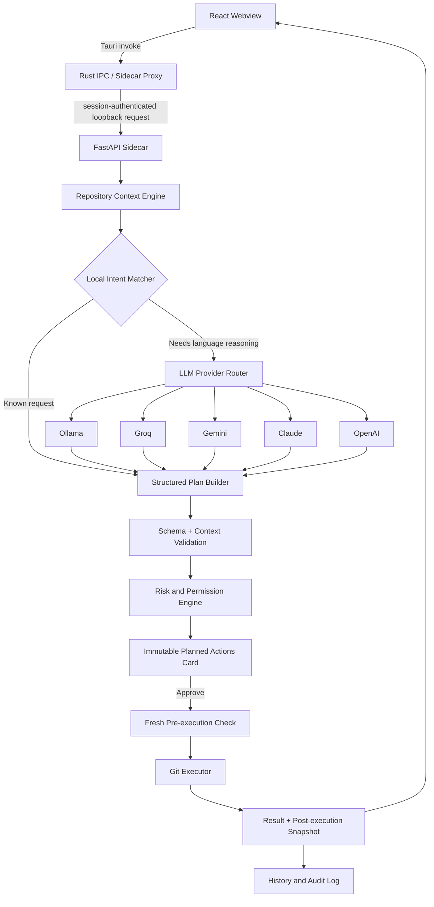

# AI Git Assistant — System Design Document

**Author:** Allan P. Erasmo  
**Status:** v1 implementation baseline  
**Last updated:** 25 June 2026  
**Decision status:** Implementation complete through Phase 3. See `IMPLEMENTATION_STATUS.md` for current state and `DECISIONS.md` for implementation-time decisions that diverge from this baseline.

---

## 1. Overview

AI Git Assistant is a local-first desktop application that helps developers understand and perform common Git workflows through natural-language conversation. It is designed to make Git easier to inspect and use without hiding the consequences of repository-changing actions.

The application allows a developer to:

- Open and manage multiple trusted local Git repositories.
- Ask plain-English questions about repository state, history, branches, and changes.
- Plan common Git workflows through a chat interface.
- Review exactly what will happen before any action changes the index, working tree, branch, history, or remote.
- Execute only fixed, validated Git operations rather than arbitrary commands.
- Use a local model or an explicitly enabled external LLM provider when local intent matching cannot safely resolve a request.

The product is both a practical productivity tool and a portfolio project demonstrating desktop application engineering, secure sidecar orchestration, structured LLM tool use, local persistence, and Git-aware safety controls.

### 1.1 v1 principles

1. **Local-first** — Git inspection and common workflows work without internet access whenever Git itself does not need network access.
2. **Safety-first** — the assistant explains and previews repository-changing actions before execution.
3. **User control** — the developer chooses the repository, provider, parameters, approval, and data-sharing level.
4. **Cost-aware** — local matching is attempted first; cloud providers are never used as a silent fallback.
5. **Constrained execution** — the assistant never receives arbitrary shell execution capability.
6. **Truth from Git** — repository state is read from the live repository, not inferred from chat history or model output.
7. **Progressive scope** — v1 supports a deliberate subset of Git well before advanced workflows are added.

### 1.2 Locked v1 stack

| Layer | Technology | Responsibility |
|---|---|---|
| Desktop shell | Tauri 2 / Rust | Window lifecycle, process spawning, IPC proxy, secure secret access, platform capabilities |
| Frontend | React + TypeScript | Three-pane desktop UI, chat, plan preview, repository context, settings |
| Local application service | Python FastAPI sidecar | Repository inspection, intent processing, provider adapters, validation, policy enforcement, Git execution, local API |
| Persistence | SQLite | Repositories, conversations, plans, history, settings metadata, audit records |
| Git integration | System Git CLI via validated argument arrays | Complete Git behaviour, standard credential helpers, familiar debugging path |
| Secure secret storage | Tauri Stronghold | Persistent external-provider API keys; never SQLite |
| Optional AI providers | Ollama, Groq, Gemini, Claude, OpenAI | Natural-language planning and explanations through a provider abstraction |

Python is selected for the execution service because it is the fastest reliable path for this project and aligns with existing FastAPI and Pydantic experience. Rust remains intentionally small but important: it owns the desktop trust boundary rather than business logic.

---

## 2. Goals and v1 Scope

### 2.1 Goals

- Natural-language interface for routine Git workflows.
- Multi-repository management with repository search, recent repositories, and repository-aware conversations.
- Local intent matching for predictable common requests.
- Provider-agnostic LLM integration for ambiguous or multi-step requests.
- Structured execution plans, not generated shell commands.
- Live repository context before planning and before executing.
- A clear risk model, immutable approval records, and local audit history.
- Windows-first desktop distribution, with architecture designed to support macOS and Linux packaging after validation.

### 2.2 Non-goals for v1

The following are deliberately deferred. They are not rejected; they are excluded to keep v1 reliable and shippable.

- Visual merge-conflict editor.
- Visual graphical diff viewer beyond rendered text summaries and Git diff output.
- Interactive rebase, rebase workflows, cherry-pick, revert, bisect, and submodule management.
- Branch deletion, `git reset`, `git clean`, force push, or any equivalent destructive operation.
- Direct source-code editing.
- Git hosting-platform features such as pull requests, issues, or code review.
- Cloud synchronisation of repositories, chats, settings, or audit history.
- Automated repair or recovery after a Git operation fails.

---

## 3. Architecture and Trust Boundaries



### 3.1 Responsibility split

**React webview**

- Displays repository data and chat history.
- Lets the user create requests, edit plan parameters, approve or cancel plans, and configure settings.
- Never owns the sidecar port, sidecar authentication token, API keys, raw repository paths, or raw Git execution capability.

**Tauri/Rust layer**

- Starts and stops the Python sidecar.
- Holds the loopback endpoint and per-session sidecar token.
- Proxies permitted requests from the webview to the sidecar through Tauri IPC.
- Uses Stronghold for persistent LLM API keys.
- Applies Tauri capabilities and least-privilege permissions for filesystem, process, and window features.

**FastAPI sidecar**

- Owns Git repository discovery, context snapshots, tool schemas, validation, risk evaluation, plan generation, execution, persistence, provider adaptation, and audit logging.
- Binds to loopback only on a dynamically assigned port.
- Accepts requests only from the Rust proxy using a short-lived session secret.
- Exposes development documentation only in development builds.

### 3.2 Why the frontend does not call FastAPI directly

A loopback API is still reachable by other local processes. A random token is useful, but it is not an absolute operating-system security boundary. The browser webview therefore does not receive the port or token. It calls a narrow Tauri command, and Rust forwards an authenticated request to the sidecar.

This is a practical v1 defence-in-depth design. It does not claim protection against malware, a compromised user account, or privileged local processes.

### 3.3 Plan lifecycle

Every request that could alter user-visible repository state follows this lifecycle:

```text
Request
  -> Select repository by internal repository ID
  -> Create a fresh context snapshot
  -> Resolve intent locally or obtain structured LLM output
  -> Validate against schema, repository state, and policy
  -> Create a single-use execution plan
  -> Display the planned actions and affected state
  -> User approves, edits, or cancels
  -> Recheck the live repository before execution
  -> Execute steps sequentially
  -> Stop on the first failure
  -> Capture results and a post-execution snapshot
```

Plans are invalidated when the relevant repository baseline has changed, when a plan has already been used, or when it reaches its short session expiry. Editing parameters creates a new plan; the frontend cannot modify a plan and submit raw execution arguments.

Multi-step plans are **not transactional**. If step 1 succeeds and step 2 fails, completed actions remain completed. The UI must show each step as completed, failed, or skipped and must not attempt automated recovery.

---

## 4. Initial UI Architecture

The v1 interface follows the three-pane desktop pattern established in the supplied reference mockup: repository and conversation navigation on the left, an execution-focused chat workspace in the centre, and live repository context on the right.

### 4.1 Top bar

The top bar contains:

- Application identity and environment label.
- Active repository selector.
- Current branch display and branch-switch entry point.
- New chat action.
- Settings entry point.
- User/profile affordance.

The repository selector changes the active **repository context** only. It does not execute a Git command.

The branch selector is not an immediate checkout control. Selecting a different branch creates a `git_switch_branch` plan, runs the normal preflight checks, and requires approval before the working tree changes.

### 4.2 Left pane: repositories and conversations

The left pane contains:

- Repository search/filter.
- Add repository action.
- Repository list showing name, canonical local path label, current branch, and concise status indicator.
- Recent conversations scoped to the active repository.
- Current provider indicator, for example `Ollama (Local)`.

A conversation stores its associated repository ID. Opening a conversation belonging to a different repository requires a repository-context switch; it must not silently execute against the currently active repository.

### 4.3 Centre pane: chat and action planning

The centre pane is the primary workspace. It contains:

- User requests and assistant explanations.
- Concise preflight context used to ground a plan.
- Planned Actions cards with ordered steps, risk badges, parameters, and conditions.
- Explicit **Approve & Execute**, **Edit**, and **Cancel** controls for writable plans.
- Per-step outcome cards after execution.
- An input composer and safe quick prompts.

A Planned Actions card displays semantic operations such as `git_commit`, the intent, parameters, affected files or branches, risk, and relevant preconditions. It does not encourage users to copy opaque shell strings.

### 4.4 Right pane: repository context

The right pane provides a live summary for the active repository:

- Repository name and canonical local path label.
- Current branch and upstream relationship.
- Working-tree summary: staged, modified, untracked, conflicts.
- Ahead/behind status and the timestamp of the most recent successful remote refresh.
- Recent commits.
- Quick actions: Status, View Diff, Branches, Stash Changes, and Refresh Remote Status.

Quick actions are never a bypass around the normal execution policy. Read-only actions may run immediately. Any state-changing action opens the corresponding plan preview.

### 4.5 UX rules

- Repository state is visually marked as **current**, **refreshing**, **stale**, or **unavailable**.
- Switching repositories invalidates any unapproved plan that belongs to the previous repository.
- A plan that becomes stale disables approval and tells the user why a fresh plan is required.
- Risk badges are assigned by the policy engine, never trusted from an LLM response.
- Error cards state what failed, what did not run, safe next steps, and a terminal-equivalent command only when appropriate for troubleshooting.
- The interface uses a dark, technical visual language consistent with the mockup: restrained contrast, monospace treatment for Git identifiers, and distinct safe, warning, and high-risk states.

---

## 5. Repository Manager

The Repository Manager supports multiple **trusted local working-tree repositories**.

### 5.1 Repository identity

A repository is selected by an internal UUID, never by a path supplied by chat or an LLM. At registration, the sidecar canonicalises and stores:

```text
Repository
├── id
├── display_name
├── canonical_worktree_path
├── git_common_dir
├── current_worktree_path
├── last_opened_at
├── last_successful_remote_refresh_at
├── external_llm_allowed
└── repository_settings
```

Git discovery verifies that the selected directory is inside a work tree and records whether the repository is bare, shallow, or part of a linked worktree. Git’s own repository-inspection commands are used rather than folder-name assumptions.

### 5.2 Supported repository conditions

v1 supports:

- Standard local repositories with a working tree.
- Repositories with a configured remote.
- Linked worktrees, provided each opened directory is registered as its own worktree context while the shared Git common directory is tracked.
- Repositories using a standard credential helper or SSH agent.

### 5.3 Restricted repository conditions

The application may show read-only data but blocks write plans when it detects:

- An in-progress merge, rebase, cherry-pick, revert, or bisect.
- Unresolved merge conflicts.
- A bare repository.
- A repository state Git cannot inspect reliably.

The message must identify the condition and direct the user to resolve it through their normal Git workflow or terminal. The assistant does not attempt automated repair.

Submodules are out of scope. A repository with submodules may be opened for basic context, but v1 does not manage submodule state and labels this limitation visibly.

### 5.4 Trusted-repository boundary

Git operations can activate repository or machine configuration such as hooks, filters, credential helpers, and signing tools. The assistant never independently runs arbitrary scripts, but Git itself may invoke configured behaviour. For that reason, v1 supports repositories the user trusts locally.

The UI warns before actions that can trigger hooks or filters, especially commit, checkout/switch, merge, and add. The application does not silently disable hooks because doing so could change the user’s established workflow.

---

## 6. Repository Context Engine

The Repository Context Engine produces a structured snapshot before planning and refreshes relevant fields immediately before execution.

### 6.1 Snapshot fields

```text
Repository identity
Current worktree and Git common directory
HEAD commit and current branch or detached-HEAD state
Configured upstream, if any
Working-tree cleanliness
Staged, modified, deleted, renamed, and untracked file counts
Unmerged paths / conflict state
Recent commits
Configured remotes
Ahead/behind count against locally cached upstream tracking state
Last successful remote refresh timestamp
Detected restricted state
```

### 6.2 Remote-state rule

Ahead/behind values are calculated from locally cached remote-tracking references. They are not presented as live remote truth unless the user has refreshed remote status successfully.

`Refresh Remote Status` invokes the allowlisted fetch operation, updates the refresh timestamp, and then recalculates ahead/behind. It does not modify the user’s worktree or current branch.

### 6.3 Context minimisation for LLMs

For external provider requests, the sidecar sends only the minimum context required to plan the request:

- Repository display name or a neutral alias when configured.
- Current branch and concise worktree counts.
- A bounded number of recent commit subjects.
- Allowed tool definitions and parameter rules.

It does **not** automatically send source code, full diffs, file contents, absolute paths, remote URLs, credentials, tokens, or audit history. A request to explain a diff requires an explicit disclosure choice for external providers.

---

## 7. Intent Resolution and LLM Provider Strategy

### 7.1 Local Intent Matcher

The Local Intent Matcher is always the first resolution stage. It matches predictable forms such as:

| User request | Result |
|---|---|
| “status”, “what changed?” | `git_status` or `git_diff`, depending on wording |
| “show branches” | `git_branch_list` |
| “show my diff” | `git_diff` |
| “last 5 commits” | `git_log` with validated limit |
| “switch to develop” | `git_switch_branch` plan |
| “create branch feature/login” | `git_create_branch` plan |
| “stash my changes” | `git_stash_push` plan |

A local match is not enough by itself for a writable action. It still proceeds through context validation, risk assignment, and the plan approval flow.

The target is to validate through telemetry-free local testing that most common day-to-day requests resolve without an LLM. This is a measured product goal, not a promise that a fixed percentage will always be achieved.

### 7.2 Provider abstraction

All providers implement the same internal contract:

```text
LLMProvider
├── validate_availability()
├── create_structured_plan()
└── explain_result()
```

Implementations:

```text
OllamaProvider
GroqProvider
GeminiProvider
ClaudeProvider
OpenAIProvider
```

The provider returns a constrained JSON plan candidate, not commands and not executable code. Providers without native tool calling may be prompted for schema-valid JSON, but their output receives the same strict validation as every other provider.

### 7.3 Provider selection and privacy

- The user selects the active provider in Settings.
- Ollama is the default local option when installed and available.
- Cloud providers must be explicitly configured with a user-owned API key and explicitly enabled.
- The app never silently changes from a local provider to a cloud provider.
- Provider pricing, free tiers, quotas, and model availability are treated as runtime information, not as permanent product guarantees.
- External LLM sharing is disabled by default for newly registered repositories until the user permits it in that repository’s settings.

### 7.4 Prompt-injection controls

Branch names, commit messages, filenames, remote names, diffs, and repository text are untrusted data. The LLM is not trusted to interpret those values as instructions.

The security control is structural: an LLM can propose only a plan candidate constrained to the Tool Registry. It cannot alter the registry, assign its own risk level, bypass preconditions, access secrets, execute a command, or make a direct sidecar request.

---

## 8. Tool Registry Principles

The Tool Registry is the safety boundary for execution. The assistant never generates or executes arbitrary shell strings.

Each tool defines:

- Tool name and semantic intent.
- Strict Pydantic parameter schema.
- Parameter validation rules.
- Repository-state preconditions.
- Risk classification rules.
- Exact argument-array builder.
- Preview fields.
- Expected result schema.
- Failure categories and safe recovery guidance.

The executor receives only a validated, server-generated plan step. It does not receive raw text from the chat UI or LLM.

### 8.1 Command execution rules

- Use `subprocess.run()` or `subprocess.Popen()` with argument arrays only.
- Never use `shell=True`.
- Use a canonical repository worktree as `cwd`.
- Insert `--` before path parameters where the Git command supports it.
- Accept only paths resolved inside the registered worktree; reject traversal, NUL bytes, control characters, and option-like path arguments.
- Validate branch and reference names with Git-compatible validation rather than regex alone.
- Bound output size, command runtime, and maximum log/diff entries.
- Disable pagers for captured command output and use `git diff --no-ext-diff` so inspection requests do not trigger an external diff command.
- Capture stdout, stderr, exit code, timing, and a sanitised result category.

---

## 9. v1 Supported Tool Set

The tool names below are semantic internal identifiers. They are safer and less ambiguous than a single generic `git_checkout` or `git_restore` tool.

| Group | Tool | Core parameters | v1 behaviour |
|---|---|---|---|
| Read | `git_status` | none | Inspect current worktree and branch state. |
| Read | `git_log` | `limit`, optional `ref` | Return a bounded commit list. |
| Read | `git_diff` | `scope`, optional paths | Show staged, unstaged, or combined change output. |
| Read | `git_branch_list` | optional scope | List local branches and, when requested, remote branches. |
| Read | `git_show_commit` | validated `ref`, detail level | Display commit summary and bounded patch/stat output. |
| Remote metadata | `git_fetch` | optional known remote | Refresh remote-tracking metadata without changing worktree or current branch. |
| Workspace | `git_stage_paths` | explicit snapshot paths | Stage only selected files. “Stage all” expands to an explicit reviewed path list. |
| Workspace | `git_unstage_paths` | explicit staged paths | Remove selected paths from the index without discarding working-tree changes. |
| Workspace | `git_stash_push` | message, include-untracked flag | Save current changes to a new stash after preview. |
| Workspace | `git_discard_worktree_paths` | explicit tracked paths | Discard uncommitted working-tree changes for selected paths; always high-risk. |
| Branch | `git_switch_branch` | existing validated branch | Switch only after conflict and overwrite preflight checks. |
| Branch | `git_create_branch` | validated new branch, start point, optional `switch_after_create` | Create a branch; switching happens only when explicitly requested and approved in the same plan. |
| History | `git_commit` | commit message | Commit currently staged files only; message must be reviewed or entered by user. |
| History | `git_merge_ff_only` | source branch | Fast-forward-only merge; refuses non-fast-forward merges in v1. |
| Remote | `git_pull_ff_only` | configured remote and tracked branch | Pull only when Git can fast-forward; no implicit merge commit. |
| Remote | `git_push` | configured remote and branch | Standard non-force push only. |

### 9.1 Explicit exclusions

v1 has no tool for:

```text
force push
reset
clean
branch deletion
interactive rebase
cherry-pick
submodule update
arbitrary command execution
```

The absence of a tool is an intentional safety control, not a missing UI button.

---

## 10. Tool Contract and Validation Requirements

The following contract is the implementation specification for every Tool Registry entry.

| Contract field | Requirement |
|---|---|
| `tool_name` | Stable semantic identifier, for example `git_commit`. |
| `parameters` | Pydantic model with bounded, typed fields and no unrecognised extras. |
| `repository_id` | Required server-side repository identifier; never an LLM-provided path. |
| `snapshot_id` | Required reference to the context snapshot used to validate the plan. |
| `preconditions` | Explicit state requirements checked during planning and immediately before execution. |
| `argument_builder` | Deterministic function that returns an argument array; no shell string. |
| `risk` | Computed by policy, never supplied by UI or LLM as authoritative. |
| `preview` | Human-readable intent, affected files/branches, conditions, and consequences. |
| `success_result` | Typed response with safe result summary and refreshed snapshot reference. |
| `failure_result` | Typed category, non-sensitive stderr summary, completed/failed/skipped status, and safe next action. |
| `audit_entry` | Sanitised request summary, plan ID, tool, approved parameters, outcome, provider provenance, timing. |

### 10.1 Example: `git_commit`

```text
Input:
  message: non-empty reviewed text within configured size limit

Preconditions:
  - Repository is a supported writable working tree.
  - No restricted Git operation is in progress.
  - No unresolved conflicts exist.
  - At least one path is staged.
  - Context snapshot is still current.

Argument array:
  ["git", "commit", "-m", <message>]

Preview:
  - Commit message
  - Exact staged file list and count
  - Current branch
  - Hook warning where hooks are detected or cannot be ruled out

Risk:
  Medium

On failure:
  - Preserve all repository state.
  - Show Git’s sanitised error category.
  - Do not attempt another commit automatically.
```

### 10.2 Example: `git_push`

```text
Input:
  remote: configured remote name
  branch: current branch or explicitly selected existing local branch

Preconditions:
  - Repository is a supported writable working tree.
  - Remote exists in the current snapshot.
  - Branch exists and matches the plan.
  - No force parameter exists in the v1 schema.
  - Context snapshot is still current.

Argument array:
  ["git", "push", <remote>, <branch>]

Preview:
  - Remote and branch
  - Current ahead/behind value with last refresh timestamp
  - Warning that remote acceptance may differ from cached local information
  - Authentication requirement notice, when relevant

Risk:
  High

On failure:
  - Stop the plan.
  - Preserve the successful local commit, if a previous plan step committed.
  - State whether authentication, remote rejection, protection rules, or network access caused the failure.
```

---

## 11. Permission and Preview Model

### 11.1 Core rule

Read-only operations may run immediately. Every operation that changes the working tree, index, branch, commit history, stash state, or remote repository is represented by a planned-action preview before it executes.

### 11.2 Risk model

| Risk | Examples | v1 handling |
|---|---|---|
| Safe | status, log, diff, branch list, show commit | Auto-run. |
| Safe network metadata | fetch / explicit remote refresh | Runs only when the user triggers refresh; reports network outcome. |
| Low | stage selected paths, unstage selected paths, stash | Planned action and explicit approval. |
| Medium | create branch, switch branch, commit, fast-forward merge | Planned action and explicit approval with affected-state detail. |
| High | discard working-tree paths, pull fast-forward-only, push | Planned action, explicit approval, stronger consequence warning. |
| Dangerous | reset hard, clean, force push, branch deletion | No v1 tool exists. Deferred and never auto-approved. |

Risk can escalate based on context. For example, switching branches with local modifications presents a higher warning than switching from a clean worktree.

### 11.3 Planned Actions card

A plan card must show:

- User intent in plain language.
- Repository and current branch.
- Ordered steps.
- Risk per step.
- Exact semantic parameters: selected paths, commit message, target branch, remote, and tracked branch.
- Preconditions and known warnings.
- The current snapshot time and status.
- Approve & Execute, Edit, and Cancel.

Approval is attached to the specific immutable plan ID. It is not a general permission to run similar future commands.

---

## 12. Git Execution and Failure Handling

### 12.1 Executor behaviour

The Git Executor runs only after a fresh pre-execution check confirms that:

- The registered repository still resolves to the same canonical worktree.
- The required branch, paths, staged state, and upstream assumptions are still valid.
- No restricted Git state or unresolved conflicts have appeared.
- The plan remains unused and belongs to the active repository context.

Each plan step executes sequentially. Execution stops after the first failure.

### 12.2 Remote operations

Remote operations use the user’s existing Git configuration, credential helper, and SSH agent. The application does not ask for Git-hosting passwords or store them.

Git terminal prompting is disabled for sidecar commands so a missing credential cannot leave the application hanging. A credential or authentication failure is surfaced clearly, with guidance to authenticate through the normal Git/hosting workflow and retry.

`git_pull_ff_only` uses Git’s fast-forward-only behaviour. If local and remote history have diverged, the operation fails without creating an implicit merge commit. This is intentional v1 behaviour.

### 12.3 Failure categories

The result layer normalises errors into practical categories:

- Validation failure.
- Unsupported or restricted repository state.
- Stale plan / repository changed since review.
- Authentication or credential failure.
- Network or remote-host failure.
- Remote rejection or branch protection failure.
- Git conflict or non-fast-forward refusal.
- Git hook, filter, signing, or configuration failure.
- Unexpected execution failure.

The user receives the safe summary first, with a collapsible technical detail section. Command output is bounded and sanitised before persistence.

---

## 13. Security and Privacy

### 13.1 Security controls

- Git is executed using validated argument arrays; `shell=True` is prohibited.
- The webview has no direct sidecar endpoint, sidecar token, or command-execution capability.
- FastAPI binds only to `127.0.0.1` on a dynamic local port.
- Rust creates a high-entropy, per-session sidecar secret and proxies authenticated requests.
- API keys are stored in Tauri Stronghold, not SQLite, local settings files, logs, chat messages, or audit records.
- When an external provider is active, the selected key is made available to the sidecar only for the active application session and is retained in memory only. This is a pragmatic v1 design, not protection against malware or privileged local access.
- The sidecar never logs credentials, bearer headers, complete remote URLs containing tokens, or unredacted secrets found in command output.
- Tauri capabilities are minimised to the specific filesystem and process actions required by the application.
- Development-only endpoints such as interactive API documentation are disabled in normal packaged releases.

### 13.2 Privacy rules

- No telemetry is enabled by default.
- Repository data stays local unless the user explicitly enables an external LLM provider for that repository.
- Full diffs and source-file content are never sent to a provider automatically.
- Absolute paths, remote URLs, credentials, and recognised secret patterns are redacted before external provider requests.
- Conversations, plans, and audit history remain local and can be cleared by the user.
- The UI indicates whether a request is being resolved locally or whether an external provider will receive minimised context.

### 13.3 Audit-log safeguards

Audit logs support traceability, not surveillance. They record the semantic tool executed, approved parameters after redaction, result category, provider provenance, timing, and repository ID. They do not store API keys, authentication headers, raw token-bearing URLs, or unbounded stdout/stderr.

---

## 14. Local Persistence

SQLite is accessed only by the FastAPI sidecar. It uses schema migrations, foreign-key enforcement, and WAL mode.

| Table | Purpose |
|---|---|
| `repositories` | Repository identity, canonical path metadata, settings, timestamps. |
| `conversations` | Repository-scoped conversation metadata and messages. |
| `context_snapshots` | Bounded snapshot metadata used by plans. |
| `execution_plans` | Immutable plan data, review state, invalidation reason, expiry, and outcome. |
| `command_history` | Sanitised executed-tool history and result metadata. |
| `settings` | Non-secret global preferences only. |
| `schema_migrations` | Applied schema versions. |

API keys do not appear in SQLite. Provider configuration stores a Stronghold key reference, provider ID, model selection, and user-facing enablement state only.

History retention is user-configurable. The default, retention choices, and clear-history function are implemented as settings rather than unchangeable code constants.

---

## 15. Sidecar Lifecycle and Packaging

### 15.1 Application startup

```text
Tauri starts
  -> Verify bundled FastAPI sidecar can launch
  -> Allocate dynamic loopback port
  -> Generate per-session sidecar secret
  -> Start sidecar with runtime-only configuration
  -> Wait for authenticated health handshake
  -> Verify system Git is available
  -> Enable repository actions only when service and Git checks pass
```

On shutdown, Tauri asks the sidecar to close cleanly, waits for a short bounded period, then terminates the child process if needed.

### 15.2 Startup and health requirements

- The app runs `git --version` at startup and exposes a clear remediation message when Git is unavailable.
- The sidecar has a readiness timeout and a visible recover/restart action.
- The frontend cannot issue repository calls until startup checks succeed.
- Operational logs are kept separate from application protocol output and are redacted.

### 15.3 Distribution requirements

The FastAPI service is compiled to a platform-specific standalone executable and bundled as a Tauri sidecar. Each supported operating system and CPU architecture needs a matching sidecar artifact.

Windows is the first packaging target. macOS and Linux distribution are validated only after the Windows build has a repeatable installer, clean startup/shutdown, bundled Git detection, and successful sidecar handshake.

A packaging spike occurs early in implementation, before feature completeness, to prove:

- Sidecar bundling.
- Dynamic port and health handshake.
- Stronghold access.
- Git discovery.
- Shutdown cleanup.
- Installer behaviour on a machine without a Python development environment.

---

## 16. Suggested Project Structure

```text
ai-git-assistant/
├── src/                              # React / TypeScript UI
│   ├── components/
│   ├── features/
│   │   ├── chat/
│   │   ├── repositories/
│   │   ├── plans/
│   │   ├── context/
│   │   └── settings/
│   ├── stores/
│   └── lib/
├── src-tauri/                         # Tauri / Rust shell
│   ├── src/
│   │   ├── main.rs
│   │   ├── sidecar_proxy.rs
│   │   ├── secure_storage.rs
│   │   └── commands.rs
│   ├── capabilities/
│   └── tauri.conf.json
├── sidecar/                           # Python FastAPI service
│   ├── app/
│   │   ├── api/
│   │   ├── core/
│   │   ├── db/
│   │   ├── git/
│   │   ├── intent/
│   │   ├── llm/
│   │   ├── plans/
│   │   ├── repositories/
│   │   └── schemas/
│   ├── tests/
│   └── pyproject.toml
├── docs/
│   ├── TOOL_CONTRACT.md
│   ├── THREAT_MODEL.md
│   ├── API_CONTRACT.md
│   └── TEST_STRATEGY.md
└── scripts/
```

---

## 17. Implementation Order

### Phase 0 — foundation spike

- Create Tauri + React shell.
- Bundle and launch a minimal FastAPI sidecar.
- Implement Rust IPC proxy and authenticated health handshake.
- Confirm system Git discovery.
- Prove packaged Windows startup and shutdown.

### Phase 1 — repository and read-only workflows

- Repository registration, canonicalisation, and context snapshots.
- SQLite migrations and repository-scoped conversation model.
- `git_status`, `git_log`, `git_diff`, `git_branch_list`, and `git_show_commit`.
- Three-pane UI with live repository context and read-only quick actions.
- Local intent matcher for read-only requests.

### Phase 2 — plans and safe write workflows

- Immutable execution-plan model and policy engine.
- Plan preview, stale-plan invalidation, approval, cancellation, and audit output.
- `git_stage_paths`, `git_unstage_paths`, `git_stash_push`, `git_switch_branch`, and `git_create_branch`.
- Unit, integration, and end-to-end tests for validation and confirmation flows.

### Phase 3 — history and remote workflows

- `git_commit`, `git_fetch`, `git_merge_ff_only`, `git_pull_ff_only`, and `git_push`.
- Credential-failure and non-fast-forward handling.
- Pre-execution recheck and multi-step stop-on-failure behaviour.

### Phase 4 — LLM providers and hardening

- Ollama provider first.
- External-provider enablement, Stronghold-managed key handling, context minimisation, and disclosure UI.
- Provider adapters, structured plan validation, provider failure handling.
- Security review, error-state polish, packaging tests, and portfolio documentation.

---

## 18. Definition of Done for v1

v1 is ready for release when all of the following are true:

- A user can register multiple trusted repositories and safely switch active repository context.
- Read-only Git workflows resolve locally and display grounded live context.
- Every writable operation is generated from an allowlisted tool schema and shown in an immutable plan before execution.
- The app rejects arbitrary command text, unsupported tool names, unrecognised parameters, unsafe paths, invalid refs, and stale plans.
- A plan rechecks live repository conditions immediately before execution.
- Multi-step plans stop on failure and accurately report completed, failed, and skipped actions.
- No v1 operation can force-push, reset, clean, delete a branch, or run a raw shell command.
- Git credential failures do not block the UI indefinitely and do not collect credentials in the app.
- API keys are absent from SQLite and application logs.
- External LLM usage is explicit, per-provider and per-repository, with minimised context.
- The packaged Windows build starts the sidecar, detects Git, shuts down cleanly, and works without Python installed.
- Core plan, validation, permission, and executor paths have automated tests against disposable Git repositories.

---

## 19. Future Considerations

| Deferred capability | Reconsider only when |
|---|---|
| Visual diff viewer | Read-only context and chat workflow are stable and user testing shows a clear need. |
| Merge-conflict assistant | Repository-state detection, plan safety, and failure reporting have been proven in real use. |
| Rebase / cherry-pick guidance | The simpler tool contracts have sustained reliable test coverage and recovery boundaries are designed. |
| Force push / reset / clean | A stronger dangerous-operation design, user education, and irreversible-action safeguards are established. |
| GitHub, GitLab, Bitbucket, Jira, Azure DevOps | The local Git core is mature and integration data boundaries are explicitly designed. |
| Repository insights and commit analytics | Local history collection is stable and privacy controls remain clear. |
| Cloud sync | There is a demonstrated multi-device need and an end-to-end security model exists. |

---

## 20. Technical References

The architecture decisions above were checked against official primary documentation for the required capabilities:

1. Tauri sidecar bundling and external binaries: https://v2.tauri.app/develop/sidecar/
2. Tauri desktop architecture and webview-to-Rust message passing: https://v2.tauri.app/concept/architecture/
3. Tauri Stronghold secure-storage plugin: https://v2.tauri.app/plugin/
4. Git repository inspection: https://git-scm.com/docs/git-rev-parse
5. Git fast-forward-only pull behaviour: https://git-scm.com/docs/git-pull
6. Git branch/reference validation: https://git-scm.com/docs/git-check-ref-format
7. Git credential and terminal prompt behaviour: https://git-scm.com/docs/gitcredentials

---

## 21. Final v1 Position

AI Git Assistant v1 is a **local-first, execution-constrained Git companion**, not a general terminal agent and not a replacement for advanced Git tooling. The product’s credibility depends on two things remaining true throughout implementation:

1. Git state and execution policy are authoritative; LLM output is only a constrained planning input.
2. The user sees and approves every meaningful repository-changing action before it runs.

The next implementation deliverables are:

1. `TOOL_CONTRACT.md` with exact Pydantic schemas, preconditions, argument builders, preview fields, and test cases for each v1 tool.
2. `THREAT_MODEL.md` covering local-process trust, repository trust, external LLM disclosure, key handling, and log redaction.
3. `API_CONTRACT.md` defining the Tauri proxy commands and FastAPI plan/context/result schemas.
4. Phase 0 packaging spike before UI feature work expands.
