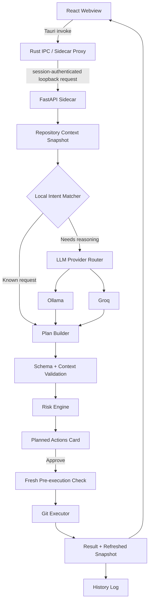

# AI Git Assistant — v1 MVP Build Plan

**Author:** Allan P. Erasmo
**Status:** All three phases complete — see `IMPLEMENTATION_STATUS.md` for current state.
**Last updated:** 25 June 2026
**Relationship to other docs:** `AI_Git_Assistant_System_Design_v1_Implementation_Baseline.md` is the full reference architecture. It is correct and worth keeping as the north star. This document trims it down to the smallest version that still proves every core idea, so implementation can start this week instead of after several more weeks of specification.

---

## 0. What changed from the full baseline, and why

| Full baseline | This MVP plan | Reason |
|---|---|---|
| 16 v1 tools | 11 tools | Covers the full daily workflow (inspect, stage, commit, push, pull, branch, stash). The other 5 (`git_show_commit`, `git_fetch`, `git_unstage_paths`, `git_discard_worktree_paths`, `git_merge_ff_only`) are real but not needed to prove the architecture or to be useful day to day. Fast-follow after v1 ships. |
| 5 LLM providers wired before launch | Five providers implemented: Anthropic, Gemini, OpenAI, Groq, Ollama | The provider abstraction was built first; adding providers was mechanical. Gemini uses Google's OpenAI-compatible endpoint — no extra SDK. |
| 4 separate docs (`TOOL_CONTRACT.md`, `THREAT_MODEL.md`, `API_CONTRACT.md`, `TEST_STRATEGY.md`) required before coding | Folded into this single document | The content matters, the document count doesn't. Splitting it into four polished files before writing code is where projects like this stall. |
| Tauri Stronghold / OS keychain for secret storage | SQLite `app_settings` table, plaintext | Tauri 2 keychain plugin had unclear maintenance status at implementation time. Key is never returned by the API; plaintext is documented in the UI as a known tradeoff. Replacing with the keychain is a one-method change. |
| Multi-worktree, bare repo, submodule handling specified | Out of scope for v1, standard single working-tree repos only | Real edge cases, rare in everyday use. Detecting and rejecting them gracefully is a one-line check, not a feature to build now. |
| 5 implementation phases | 3 phases | Smaller phases are easier to actually finish given the capstone and job-hunting timeline. |
| Exhaustive failure taxonomy (9 categories) | 5 practical categories | Covers what will realistically happen in testing without over-designing error handling before there's real usage to learn from. |

Everything else, the trust boundary, the plan lifecycle, the risk tiers, the tool registry pattern, stays exactly as designed in the full baseline. That architecture is not the part that needed trimming.

---

## 1. Overview and Principles

AI Git Assistant is a local-first desktop application that helps a developer perform common Git workflows through natural-language chat, without hiding what a command will do before it runs.

**v1 MVP principles, unchanged from the full baseline:**

1. **Local-first** — works offline whenever Git itself doesn't need the network.
2. **Safety-first** — every repository-changing action is previewed and approved before it runs.
3. **User control** — the developer picks the repository, the provider, and approves every plan.
4. **Cost-aware** — local intent matching is tried first, cloud providers are opt-in, never a silent fallback.
5. **Constrained execution** — the assistant never gets arbitrary shell access, only a fixed set of validated tools.
6. **Truth from Git** — repository state is read live from Git, never inferred from chat history.

---

## 2. Locked v1 MVP Stack

| Layer | Technology | Notes |
|---|---|---|
| Desktop shell | Tauri 2 / Rust | Window lifecycle, sidecar process management, IPC proxy |
| Frontend | React + TypeScript | Three-pane UI: repositories, chat with plan cards, repository context |
| Local service | Python FastAPI sidecar | Intent matching, provider routing, validation, execution, persistence |
| Persistence | SQLite | Repositories, conversations, plans, history |
| Git integration | System Git CLI, argument arrays only, `shell=False` | Complete, predictable, debuggable |
| Secrets | OS keychain via lightweight Tauri plugin | API keys, never in SQLite or plaintext |
| LLM providers (v1) | Ollama (default, local) + Groq (free tier, cloud) | Gemini/Claude/OpenAI added later via the same provider interface |

Same reasoning as before: Python because it's your fastest reliable path, Rust stays thin and owns only the trust boundary, not business logic.

---

## 3. Goals and Non-Goals (v1 MVP)

**Goals**

- Natural-language chat for the 11 most common Git operations (see section 7)
- Multi-repository switching from the sidebar
- Local intent matching first, LLM fallback second
- Plan preview and approval for every write operation
- Risk-tiered permissions, no tool exists for destructive operations
- Working packaged Windows build, no Python required by the end user

**Non-Goals (v1 MVP, deferred not rejected)**

- `git_show_commit`, `git_fetch` (standalone), `git_unstage_paths`, `git_discard_worktree_paths`, `git_merge_ff_only` — fast-follow after v1 ships
- Force push, reset, clean, branch delete — no tool ever, this is a permanent safety boundary, not a v1 gap
- Visual diff viewer, merge conflict editor, rebase/cherry-pick — out of scope, see Future Considerations
- Bare repos, linked worktrees, submodules — detected and politely rejected with a clear message, not supported
- macOS/Linux packaging — Windows first, ported after the Windows build is solid
- More than two LLM providers wired at launch

---

## 4. Architecture and Trust Boundary



**Unchanged from the full baseline, this is the part worth keeping exactly as designed:**

- The webview never holds the sidecar port, the sidecar token, or any API key. It calls a Tauri command, Rust forwards an authenticated request.
- FastAPI binds to `127.0.0.1` on a dynamically assigned port.
- A per-session token, generated at launch by Rust and passed to the sidecar's runtime only, authenticates every proxied request.
- Every write-capable plan is built from a fresh repository snapshot, rechecked immediately before execution. If the repo changed in between, the plan is rejected and the user is asked to retry, not silently re-run against stale state.

This is the single most valuable piece of the original spec, it's genuinely good security design, and it isn't expensive to build, so it stays exactly as scoped.

---

## 5. Three-Pane UI (unchanged direction, same as your reference mockup)

- **Left:** repository list (search/filter, add repository), recent conversations scoped per repository, active provider indicator
- **Centre:** chat, Planned Actions cards with risk badges, Approve & Execute / Edit / Cancel, per-step result cards
- **Right:** live repository context (branch, staged/modified/untracked counts, ahead/behind, recent commits), Quick Actions for the safe-tier commands

Quick Actions only run read-only tools immediately. Anything that changes repo state always opens a plan preview, no exceptions, no shortcuts.

---

## 6. Repository Manager (simplified)

A repository is selected by internal ID, never a raw path from chat. At registration, store:

```text
Repository
├── id
├── display_name
├── local_path
├── current_branch
├── last_opened_at
└── external_llm_allowed
```

On registration, check the directory is a standard Git working tree. If it's bare, a linked worktree, or has submodules, show a clear "not supported in v1" message rather than attempting partial support.

If an in-progress merge, rebase, or unresolved conflict is detected, the app shows read-only status but blocks all write plans until the user resolves it through their normal Git workflow.

---

## 7. v1 MVP Tool Set (11 tools)

| Group | Tool | Core parameters | Risk |
|---|---|---|---|
| Read | `git_status` | none | Safe, auto-run |
| Read | `git_log` | `limit`, optional `ref` | Safe, auto-run |
| Read | `git_diff` | `scope` (staged/unstaged/all) | Safe, auto-run |
| Read | `git_branch_list` | optional scope | Safe, auto-run |
| Workspace | `git_stage_paths` | explicit file list | Low, confirm |
| Workspace | `git_stash_push` | message, include-untracked | Low, confirm |
| Branch | `git_switch_branch` | existing branch name | Medium, confirm |
| Branch | `git_create_branch` | new branch name, start point | Medium, confirm |
| History | `git_commit` | commit message | Medium, confirm |
| Remote | `git_pull_ff_only` | remote, branch | High, confirm + warning |
| Remote | `git_push` | remote, branch | High, confirm + warning |

No tool exists for force push, reset, clean, or branch deletion. That's a permanent boundary, not a phase-1 limitation.

**Execution rule, unchanged:** `subprocess.run()` with argument arrays only, `shell=False` always, `cwd` set to the registered repository path, `--` inserted before path arguments.

---

## 8. Tool Contract Pattern (apply this shape to all 11 tools)

Use this exact structure for each tool, defined as a Pydantic model plus a deterministic argument builder. Two worked examples below, the rest follow the same shape.

**`git_commit`**

```text
Input: message (non-empty, max length enforced)
Preconditions: at least one staged file, no unresolved conflicts, snapshot still current
Argument array: ["git", "commit", "-m", <message>]
Preview: message, staged file list, current branch
Risk: Medium
On failure: preserve repo state, show sanitised error, do not auto-retry
```

**`git_push`**

```text
Input: remote (must exist in current snapshot), branch (current or explicit)
Preconditions: remote exists, branch matches plan, no force parameter exists in schema
Argument array: ["git", "push", <remote>, <branch>]
Preview: remote, branch, ahead/behind at last refresh, auth requirement notice
Risk: High
On failure: stop the plan, state whether it was auth, rejection, or network related
```

Build the remaining 9 tools the same way, each as its own small Pydantic model and argument builder function. This is mechanical work once the pattern is set, budget roughly half a day per tool including a basic test.

---

## 9. Permission Model

| Risk | Tools | Behaviour |
|---|---|---|
| Safe | status, log, diff, branch list | Auto-run, no confirmation |
| Low | stage paths, stash | Plan preview, one-click approve |
| Medium | commit, create branch, switch branch | Plan preview, explicit approve |
| High | pull, push | Plan preview, explicit approve, extra warning text |

Risk is always assigned by the policy engine in code, never trusted from LLM output or the UI.

---

## 10. Local Intent Matcher

Resolve these patterns without calling an LLM:

| User says | Tool |
|---|---|
| "status" / "what changed" | `git_status` |
| "show branches" | `git_branch_list` |
| "show diff" / "what's the diff" | `git_diff` |
| "last N commits" / "log" | `git_log` |
| "switch to X" / "checkout X" | `git_switch_branch` (plan) |
| "create branch X" | `git_create_branch` (plan) |
| "stash my changes" | `git_stash_push` (plan) |

Anything else, including multi-step requests like "commit and push," falls through to the LLM Provider Router. A local match for a write action still goes through plan preview and approval, matching does not skip safety.

---

## 11. Provider Strategy (v1 MVP: two providers)

- **Ollama**, default, local, free, used automatically if installed
- **Groq**, free-tier cloud fallback, opt-in, explicit per-repository enablement required before any context is sent externally

Both implement the same interface:

```text
LLMProvider
├── validate_availability()
├── create_structured_plan()
└── explain_result()
```

Gemini, Claude, and OpenAI adapters are written later, same interface, same validation, no architecture change needed. Don't build them until the two-provider version is working end to end.

**Context minimisation, unchanged from the full baseline:** send only repo name, current branch, bounded worktree counts, a few recent commit subjects, and the tool schema. Never full diffs, file contents, paths, or credentials unless the user explicitly asks for change explanations and has enabled external sharing for that repo.

---

## 12. Failure Handling (5 practical categories)

- Validation failure (bad input, schema mismatch)
- Stale plan (repo changed since the plan was built, ask user to retry)
- Authentication/credential failure (push/pull only, point to normal Git auth workflow)
- Network/remote failure
- Unexpected execution failure (catch-all, show sanitised error)

Multi-step plans stop on first failure. Already-completed steps stay completed, the UI shows step-by-step status (done / failed / not run), no automated rollback.

---

## 13. Security and Privacy (unchanged core controls)

- `shell=True` is never used, ever
- Webview has no direct sidecar access, only the Tauri-proxied path
- FastAPI binds to `127.0.0.1` only, dynamic port, per-session token
- API keys live in OS keychain storage, never SQLite, never logs, never chat history
- No telemetry by default
- Full diffs and file contents are never sent to a provider automatically
- The UI always shows whether a request is being resolved locally or sent externally

---

## 14. Local Persistence (simplified schema)

| Table | Purpose |
|---|---|
| `repositories` | id, name, path, last_opened |
| `conversations` | id, repository_id, timestamp, messages |
| `command_history` | id, repository_id, tool_name, parameters, result, timing |
| `settings` | key, value (non-secret only) |

Dropped the separate `context_snapshots` and `execution_plans` tables from the full baseline for v1, snapshots and plans can live in memory for the session and only the final executed result needs to persist. Add persisted plan history later if audit requirements grow.

---

## 15. Sidecar Lifecycle

```text
Tauri starts
  -> Launch bundled FastAPI sidecar
  -> Allocate dynamic loopback port
  -> Generate per-session token
  -> Wait for authenticated health check
  -> Run "git --version", show install prompt if missing
  -> Enable repository actions once both checks pass
```

On shutdown, Tauri asks the sidecar to close, waits briefly, force-terminates if needed.

**Packaging:** one focused spike early, before feature work, proving sidecar bundling, port/token handshake, Git detection, and a clean install/uninstall on a machine without Python. Windows only for v1.

---

## 16. Project Structure

```text
ai-git-assistant/
├── src/                    # React/TypeScript UI
│   ├── components/
│   ├── features/
│   │   ├── chat/
│   │   ├── repositories/
│   │   ├── plans/
│   │   └── context/
│   └── lib/
├── src-tauri/               # Rust shell
│   ├── src/
│   │   ├── main.rs
│   │   ├── sidecar_proxy.rs
│   │   └── secure_storage.rs
│   └── tauri.conf.json
├── sidecar/                 # Python FastAPI service
│   ├── app/
│   │   ├── api/
│   │   ├── git/
│   │   ├── intent/
│   │   ├── llm/
│   │   ├── plans/
│   │   └── schemas/
│   └── tests/
└── this-document.md         # Single source of truth, no separate spec files
```

---

## 17. Implementation Order (3 phases)

**Phase 1 — Foundation and read-only** ✅ Complete
- Tauri + React shell, FastAPI sidecar bundled and launching
- Rust IPC proxy with authenticated handshake
- Git detection on startup
- Repository registration, single active repo to start
- `git_status`, `git_log`, `git_diff`, `git_branch_list`
- Three-pane UI with live context panel
- Local intent matcher for read-only requests
- **Milestone: you can open a real repo and ask it questions, no writes yet**

**Phase 2 — Plans and writes** ✅ Complete
- Plan model, risk engine, preview card, approve/cancel flow, stale-plan recheck
- 11 write commands: `STAGE`, `UNSTAGE`, `DISCARD`, `COMMIT`, `PUSH`, `PULL`, `SWITCH_BRANCH`, `CREATE_BRANCH`, `STASH`, `STASH_POP`, `DELETE_BRANCH`
- Multi-repository switching
- 49 automated unit tests
- **Milestone: the full daily workflow works end to end with approval gates**

**Phase 3 — Providers and polish** ✅ Complete
- Five LLM providers (Anthropic, Gemini, OpenAI, Groq, Ollama) via shared `LLMProvider` abstraction
- LLM fallback: unrecognised requests route to the LLM, which returns the same `LocalActionPlan` schema
- LLM plan validation layer (wildcard path detection, remote validation, commit message enforcement)
- Settings modal and per-repository AI toggle
- `source: "local" | "llm"` field on plans; AI badge on LLM-generated plan cards
- Post-launch: Gemini provider added (`gemini-3.5-flash`); local matcher extended to resolve "logs" phrasing without LLM
- **Remaining:** Windows installer packaging and integration test temp-dir fix

---

## 18. Definition of Done (v1 MVP)

- A user can register a repository and switch between multiple repositories
- All 4 read-only tools resolve locally and show live repo state
- All 7 write tools go through plan preview, approval, fresh recheck, then execution
- No tool exists for force push, reset, clean, or branch delete
- The app rejects unsupported tool names, bad parameters, and stale plans
- Multi-step plans stop on first failure and report step status accurately
- API keys never appear in SQLite or logs
- External LLM usage is opt-in per repository, with minimised context
- Packaged Windows build runs without Python installed, detects Git, shuts down cleanly
- Core plan and executor paths have automated tests against disposable repos

---

## 19. Future Considerations (fast-follow after v1 ships)

| Deferred | Add when |
|---|---|
| `git_show_commit`, `git_fetch`, `git_unstage_paths`, `git_discard_worktree_paths`, `git_merge_ff_only` | v1 is stable and these come up in real usage |
| Gemini, Claude, OpenAI providers | Two-provider abstraction is proven, just add adapters |
| Stronghold or stronger secret vault | OS keychain approach shows a real limitation |
| Visual diff viewer, merge conflict assistant | Core chat workflow is stable and users ask for it |
| Force push / reset / clean | A dedicated dangerous-action design exists, not before |
| macOS / Linux packaging | Windows build is solid and there's real demand |
| GitHub/GitLab/Jira integrations | Local core is mature |

---

## 20. What to build first, literally tomorrow

1. `src-tauri` skeleton that launches a "hello world" FastAPI sidecar and proves the authenticated proxy round-trip works. Nothing else. This de-risks the riskiest architectural piece before any Git logic is written.
2. Once that round-trip works, add `git_status` as the first real tool, end to end: Pydantic schema, argument builder, FastAPI route, Tauri proxy call, React display. This becomes the template every other tool copies.
3. Everything else in this document is mechanical repetition of that pattern.
