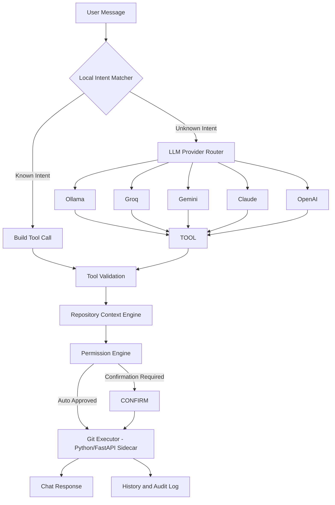

# AI Git Assistant — System Design Document

**Author:** Allan P. Erasmo
**Status:** v1 Locked
**Last updated:** 25 June 2026

---

## 1. Overview

AI Git Assistant is a local-first desktop application that lets a developer interact with Git repositories using natural language instead of memorizing commands and syntax.

The application allows a developer to:

- Open and manage multiple Git repositories
- Ask questions about repository status in plain English
- Perform common Git operations through chat
- Understand potentially risky commands before executing them
- Receive contextual recommendations based on live repository state

The system is designed around four principles:

1. **Local-first** — most operations execute without internet connectivity
2. **Safety-first** — potentially destructive actions always require explicit confirmation
3. **Cost-aware** — most requests are resolved locally without consuming API credits
4. **Provider-agnostic** — the user picks which LLM powers the assistant, free or paid

The application is intended to be both a daily productivity tool and a portfolio project, showcasing desktop application development, AI integration with structured tool execution, and secure command orchestration.

**Locked v1 stack:** Tauri + React/TypeScript frontend, Python FastAPI sidecar, SQLite for local persistence, direct Git CLI via subprocess using validated argument arrays. See sections 15 and 20 for the full reasoning behind each choice.

---

## 2. Goals and Non-Goals

**Goals**

- Natural language interface for Git workflows
- Multi-repository management, switch between repos and branches from the sidebar
- Local intent matching for common Git operations, near-zero cost by default
- Multi-provider LLM support (Ollama, Groq, Gemini, Claude, OpenAI)
- Structured tool execution instead of raw command generation
- Repository-aware recommendations, using live repo state as context
- Permission and safety controls, tiered by risk
- Cross-platform desktop application

**Non-Goals (v1)**

Out of scope for the first build. Out of scope does not mean rejected, it means deferred so v1 stays focused and shippable. See section 19 for which of these may return as future goals, and under what condition.

- Not a replacement for advanced Git GUI applications
- No visual merge conflict editor
- No graphical diff viewer
- No support for Git rebase workflows
- No support for cherry-pick workflows
- No support for submodules
- No direct code editing capabilities
- No cloud synchronisation

---

## 3. High-Level Architecture



The Tauri shell (Rust) handles window management and native OS integration only. Everything below the dotted line in this diagram, intent matching, provider routing, tool validation, repository context, permissions, and git execution, runs inside a local Python FastAPI server, launched by Tauri as a sidecar process. See section 15 and section 19 for details on this decision.

---

## 4. Core Components

| Component | Responsibility |
|---|---|
| Chat UI | Displays conversations, confirmations, history, and settings |
| Repository Manager | Handles repository selection and switching |
| Local Intent Matcher | Resolves common requests without AI, the main cost control mechanism |
| LLM Provider Router | Routes requests to the selected provider |
| Provider Adapters | Normalises different provider APIs into one shared interface |
| Tool Registry | Defines the fixed set of allowed Git operations |
| Repository Context Engine | Inspects live repository state before each action |
| Permission Engine | Determines approval requirements by risk tier |
| Git Executor | Executes validated Git commands, runs inside the Python sidecar |
| History Logger | Stores conversations and command history locally |
| Settings Manager | Persists user preferences, including provider choice and permission overrides |

---

## 5. Repository Manager

The application supports multiple repositories at once.

Features:

- Repository sidebar with search/filter
- Recently opened repositories
- Current branch display per repo
- Repository status indicators (clean, dirty, ahead/behind)
- Quick branch switching

Repository metadata stored locally:

```text
Repository
├── Name
├── Local Path
├── Current Branch
├── Last Opened
├── Last Command Executed
└── Repository Settings
```

---

## 6. Local Intent Matcher (Primary Cost Control)

The Local Intent Matcher is the first stage of request processing, and the main reason this tool stays close to zero cost in everyday use. Before any LLM call, the app checks the user's text against known patterns.

Examples:

| User Request | Tool |
|---|---|
| status / what changed | git_status |
| show branches | git_branch_list |
| show diff / what's the diff | git_diff |
| last 5 commits / log | git_log |
| switch to develop / checkout develop | git_checkout |
| create branch feature/login | git_create_branch |
| stash my changes | git_stash |

Benefits:

- Zero cost, no API call made
- Works fully offline
- Low latency, instant response
- Predictable behaviour, same input always produces the same tool call

**Target: roughly 70 to 80 percent of everyday Git requests should resolve locally**, with the remainder (multi-step requests, commit messages, ambiguous phrasing) falling through to the LLM Provider Router.

---

## 7. Repository Context Engine

Before executing any command, the application analyses live repository state. This context is given to both the Local Intent Matcher and the LLM, so suggestions and tool calls are grounded in what's actually happening in the repo, not guessed.

Collected information:

- Current branch
- Repository cleanliness (clean/dirty working tree)
- Staged files, modified files, untracked files
- Ahead/behind remote state
- Merge conflict state
- Recent commits
- Existing remotes

Example:

```text
Repository: GlaucomaAI
Branch: feature/reports
Modified Files: 4
Staged Files: 2
Untracked Files: 1
Remote Status: 2 commits ahead
Working Tree: Dirty
```

To keep this cheap when it does reach the LLM, only a short summary like the one above is sent, never a full diff or full file contents unless the user specifically asks to see changes explained.

---

## 8. LLM Provider Abstraction

All providers implement a common interface, so the rest of the app never needs to know which one is active.

```text
LLMProvider (interface)
    parse_intent()
    generate_tool_call()
    explain_action()
```

Implementations:

```text
OllamaProvider
GroqProvider
GeminiProvider
ClaudeProvider
OpenAIProvider
```

Ollama needs a fallback path for local models that don't support native tool calling, prompting for structured JSON output instead and parsing it manually.

---

## 9. Provider Priority and Cost Strategy

Default provider order, configurable by the user in Settings:

1. **Ollama** — local, fully free, used if installed
2. **Groq** — free tier, Llama models, very low cost even past free tier
3. **Gemini Flash** — free tier with quota
4. **Claude Haiku/Sonnet** — paid, opt-in for better reasoning on complex requests
5. **OpenAI** — paid, opt-in

Additional cost control practices, layered on top of the Local Intent Matcher:

- Send minimal git context to the LLM: file names changed and a short stat summary, not full diffs, unless the user explicitly asks for change explanations
- Truncate git log context sent to the model to the last 5 to 10 entries
- Use prompt caching where the provider supports it (Claude supports this for repeated system prompts and tool definitions)
- Set a small `max_tokens` limit on responses, since tool calls are short by design
- Default to free-tier providers unless the user opts into a paid model

---

## 10. Tool Registry

The assistant never generates raw shell commands. It selects from a fixed list of approved tools, which avoids hallucinated flags and keeps every possible action predictable and auditable.

Examples:

```json
{
  "tool": "git_status"
}
```

```json
{
  "tool": "git_commit",
  "parameters": {
    "message": "Add login validation"
  }
}
```

```json
{
  "tool": "git_push",
  "parameters": {
    "branch": "develop",
    "force": false
  }
}
```

---

## 11. Supported Tools (v1)

**Read Operations**
- git_status
- git_log
- git_diff
- git_branch_list
- git_show_commit

**Workspace Operations**
- git_add
- git_restore
- git_stash

**Branch Operations**
- git_checkout
- git_create_branch

**History Operations**
- git_commit
- git_merge

**Remote Operations**
- git_pull
- git_push

---

## 12. Permission Model

| Risk | Commands | Default |
|---|---|---|
| Safe | status, log, diff | Auto-run |
| Low | add, restore, stash | Auto-run |
| Medium | commit, checkout, merge | Confirm |
| High | push, reset, branch delete | Confirm + warning |
| Dangerous | force push, reset hard, clean | Always confirm, locked, cannot be set to auto-run even by user override |

`git reset --hard`, `git clean -fd`, and `git push --force` always require confirmation, regardless of user settings. This is a hard guardrail, not a default.

---

## 13. Execution Flow

Example request: *"Commit my staged files and push to origin."*

```text
Chat Input
    ↓
Intent Matching
    ↓
Repository Analysis
    ↓
Tool Generation (one or more tool calls, sequenced)
    ↓
Permission Check (per tool call)
    ↓
Preview Card (Planned Actions)
    ↓
User Approval
    ↓
Git Execution
    ↓
Result Display
```

Multi-step requests like the example above produce a single Planned Actions card listing each step in order, with its own risk badge, rather than separate confirmation prompts per step. This matches how users naturally phrase chained requests.

---

## 14. Command Preview

Every repository-changing operation shows a preview before running:

```text
Intent:
Commit staged files

Action:
git commit -m "Update login validation"

Repository:
GlaucomaAI

Branch:
feature/authentication

Risk:
Medium

Files Affected:
3
```

The user may Approve, Cancel, or Edit parameters before execution.

---

## 15. Git Executor

**Backend decision: Python, not Rust.** Rust with `git2-rs` was considered, since it integrates natively with the Tauri shell. It was set aside for v1 because the project needs to ship as a working portfolio piece on a tight timeline, and Python is the language Allan already writes daily (FastAPI, SQLAlchemy on the capstone project). Rust would add a steep learning curve for marginal benefit, and isn't a common ask in the NZ DevOps/cloud roles this project is meant to support.

**FastAPI vs a simpler local service:** a lighter option, such as a plain Python script communicating over stdin/stdout, was also considered, and is technically less overhead than a full ASGI server. FastAPI was still chosen for v1 because it gives clean REST boundaries, built-in request validation via Pydantic, and a `/docs` endpoint that's genuinely useful for debugging during development. The overhead is small for a single local user and the development speed gain outweighs it.

**Architecture:** Tauri launches the Python backend (FastAPI) as a sidecar process on app start. The frontend (Tauri webview) talks to it over HTTP on `127.0.0.1` only, never exposed externally. Tauri kills the sidecar cleanly on app close.

```text
Tauri app launches
    -> Rust shell spawns Python (FastAPI) as a sidecar process
    -> FastAPI binds to 127.0.0.1 on a local port only
    -> Frontend calls it like a normal REST API (fetch)
    -> On app close, Tauri shell terminates the sidecar process
```

For distribution, the Python backend is compiled to a standalone executable (PyInstaller) and bundled inside the Tauri app via `tauri.conf.json`, so end users never need Python installed separately.

**Git integration decision: direct subprocess to system Git, not GitPython.** GitPython wraps the CLI anyway and adds an extra abstraction layer without giving more capability. Calling the Git CLI directly is complete, predictable, and matches what developers already use day to day, so behaviour is easy to reason about and easy to debug by just running the same command manually.

**Startup check:** on launch, the app runs `git --version` to confirm Git is installed and on PATH. If it isn't found, the user sees a clear message with a link to install Git, rather than the app silently failing on the first command.

The executor itself only accepts validated tool calls, and always executes using argument arrays, never a raw shell string:

```python
subprocess.run(
    ["git", "status"],
    cwd=repository_path
)
```

Benefits:

- Prevents shell injection
- Predictable execution
- Easier validation
- Safer command generation, since arguments can't be reinterpreted by a shell

---

## 16. History and Audit Log

Each interaction is recorded:

```text
Timestamp
Repository
User Request
Interpreted Intent
Tool Executed
Result
Confirmation Status
Provider Used
Execution Time
```

Benefits: auditability, debugging, command replay, usage analytics.

---

## 17. Local Persistence

**SQLite**, accessed from the Python backend.

**repositories**
- id, name, path, last_opened

**conversations**
- id, repository_id, timestamp, user_message, assistant_response

**command_history**
- id, repository_id, tool_name, parameters, result, execution_time

**settings**
- key, value

---

## 18. Security Principles

- Local-first by default, no data leaves the machine unless an external LLM provider is chosen
- API keys encrypted locally, via Tauri's secure storage
- FastAPI sidecar binds to `127.0.0.1` only, never `0.0.0.0`
- A random auth token is generated at launch by the Tauri shell and passed only to the Python sidecar's runtime environment, never written to disk. The frontend reads it from the same runtime and attaches it to each request, so no other local process can call the API by guessing the port. Token rotation, expiry, and storage are unnecessary complexity for v1, since the token only needs to live as long as the app session.
- No source code sent automatically, only minimal repository context summaries (see section 7)
- Structured tool execution only, no arbitrary shell execution
- No telemetry by default
- User-controlled history retention

---

## 19. Future Considerations (Not Goals Now, Possibly Later)

This section merges deferred v1 Non-Goals with longer-term enhancement ideas. Nothing here is rejected, it's just not in scope for the first shippable version.

| Deferred item | Why it's out of v1 | Could become a goal when |
|---|---|---|
| Visual diff viewer | Adds UI complexity, chat-based diff summary is enough for v1 | Core chat flow is stable and tested |
| Merge conflict resolution UI | High risk, needs careful UX, error-prone to automate | Permission model and execution layer are proven reliable |
| Rebase, cherry-pick, submodules | Higher complexity, higher risk of destructive mistakes | v1 tool schema pattern is validated with simpler commands first |
| Cloud sync | Out of scope for local-first v1 | If multi-device usage becomes a real need |

**Other future enhancement ideas, unordered:**

- Repository insights: commit statistics, contributor analysis, branch health metrics
- AI assistance beyond commands: explain Git concepts, suggest commit messages, suggest branch names, summarise changes
- Advanced Git features: interactive rebase assistant, cherry-pick assistant, merge conflict guidance, pull request preparation
- Integrations: GitHub, GitLab, Bitbucket, Jira, Azure DevOps

---

## 20. Suggested Technology Stack

| Layer | Technology | Why |
|---|---|---|
| Desktop Shell | Tauri (Rust) | Lightweight, native, handles window/process management only |
| Frontend | React + TypeScript | Matches Tauri's webview model, strong ecosystem |
| State Management | Zustand | Simple, minimal boilerplate for this app's scope |
| UI Components | shadcn/ui | Clean defaults, customizable |
| Backend Services | Python (FastAPI) | Matches existing skillset, fastest path to shipping, sidecar process |
| Local Database | SQLite | Lightweight, no separate server needed |
| Git Integration | Direct subprocess to system Git CLI, argument arrays only | Complete, predictable, matches what developers already use |
| AI Providers | Ollama, Groq, Gemini, Claude, OpenAI | Provider-agnostic via shared interface |
| Secure Storage | Tauri Secure Storage | For encrypted local API key storage |

---

## 21. Design Principles

1. Local-first whenever possible
2. Explain before executing
3. Prefer safety over automation
4. Minimise API usage
5. Keep the developer in control
6. Never execute arbitrary commands
7. Make Git easier, not invisible

---

*v1 design locked. Stack: Tauri + React/TypeScript + Python FastAPI sidecar + SQLite + direct Git CLI subprocess. Next: finalize UI layout based on the three-pane reference mockup (repository list, chat with planned actions, repository context panel), then begin component-level specs and start scaffolding the project structure.*
